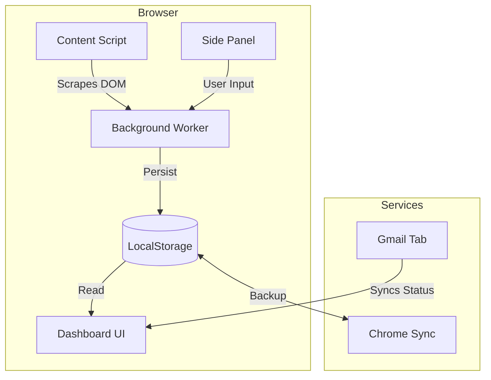

# ShadowBot

> **The brutalist, privacy-focused job application tracker for modern developers.**

[](https://github.com/ishan1410/ShadowBot)
[](LICENSE)
[](https://developer.chrome.com/docs/extensions/mv3/)

ShadowBot is a powerful **Chrome Extension** that transforms your chaotic job hunt into a streamlined pipeline. It acts as a "Shadow" that follows you across the web, automatically detecting and scraping job details from major ATS platforms, tracking your application emails, and visualizing your progress—all without your data ever leaving your browser.

---

## Features

### Auto-Detection & Scraping
Instantly extracts Role, Company, Location, and Description from supported platforms using advanced DOM heuristics.
-   **Greenhouse** (`greenhouse.io`)
-   **Lever** (`lever.co`)
-   **Ashby** (`ashbyhq.com`)
-   **Workday** (`myworkdayjobs.com`)
-   **LinkedIn** (`linkedin.com/jobs`)
-   **Generic Fallback**: Smartly detects "Apply" buttons and Job Schema on unsupported sites.

### The Command Center (Dashboard)
A centralized, notion-style dashboard running locally in your browser.
-   **Pipeline Funnel**: Visualize your conversion rates from `Applied` → `Interview` → `Offer`.
-   **Activity Heatmap**: Keep your momentum with a GitHub-style daily activity grid.
-   **Search & Filter**: Instantly find that one application from 3 weeks ago.

### Gmail Spy (Experimental)
Never wonder if your application was seen. ShadowBot syncs with your Gmail to detect:
-   **Sent**: Confirms the application email was sent.
-   **Opened**: Detects if a recruiter or system opened your email (via pixel tracking or thread updates).
-   **Ghosted**: Automatically flags applications that haven't received a reply in >7 days.

### ☁️ Cloud Sync & Privacy
-   **Local First**: All data is stored in `chrome.storage.local`.
-   **Cloud Backup**: Automatically syncs your database to your Google Account via `chrome.storage.sync`, ensuring you never lose progress across devices.

---

## Installation

Since this is a specialized tool, you can load it directly into Chrome as a developer extension.

1.  **Clone the Repository**
    ```bash
    git clone https://github.com/ishan1410/ShadowBot.git
    cd ShadowBot
    ```

2.  **Load into Chrome**
    -   Open Chrome and navigate to `chrome://extensions/`.
    -   Toggle **Developer mode** in the top right.
    -   Click **Load unpacked**.
    -   Select the `ShadowBot` folder you just cloned.

3.  **Pin & Play**
    -   Pin the 🕵️‍♂️ icon to your toolbar.
    -   Visit a job posting (e.g., [Airbnb Careers](https://careers.airbnb.com/)) to see it in action.

---

## Usage Guide

### 1. Tracking a Job
When you visit a supported job board, ShadowBot's **Side Panel** will light up or the icon will show a badge.
-   **One-Click Track**: Open the side panel to see pre-filled data.
-   **Add Tags**: Label it as "Remote", "High Priority", etc.
-   **Save**: Click "Track Application" to add it to your dashboard.

### 2. Managing Your Pipeline
Click "Open Dashboard" from the extension popup.
-   **Status Updates**: Drag and drop (or select) to move jobs from `Applied` to `Interviewing`.
-   **Notes**: Click any row to open the details drawer. Add formatted markdown notes for interview prep.
-   **Email Status**: Look for the `✓✓` (Opened) or `⑃` (Ghosted) icons next to the role name.

---

## Architecture

ShadowBot is built with a modern **Extension Manifest V3** architecture.



-   **`content.js`**: Injected scraper that normalizes data from different ATS structures.
-   **`dashboard.js`**: Vanilla JS SPA (Single Page Application) that renders the dashboard and handles analytics.
-   **`gmail_tracker.js`**: A content script bridge that queries Gmail's DOM to update application statuses.

---

## Contributing

Contributions are what make the open-source community such an amazing place to learn, inspire, and create. Any contributions you make are **greatly appreciated**.

1.  Fork the Project
2.  Create your Feature Branch (`git checkout -b feature/AmazingFeature`)
3.  Commit your Changes (`git commit -m 'Add some AmazingFeature'`)
4.  Push to the Branch (`git push origin feature/AmazingFeature`)
5.  Open a Pull Request

---

## License

Distributed under the MIT License. See `LICENSE` for more information.

---

> Built with 💻 and ☕ by [Ishan Patel](https://github.com/ishan1410).
